# Лабораторная работа 1
                     	
### Задание 1

* Исполняемый файл - файл, который содержит программу и может быть запущен.
* Ассемблер - язык низкого уровня, в котором каждая иструкция физического устройства представлена в текстовом виде.
* Исходный код - программа написанная на языке высокого уровня.
* Виртуальная машина - это средство описания семантики языка программиорования.
* Стандарт языка программирования - документ с правилами и возможностями языка.
* Траснлятор - программа, осуществляющая перевод кода с одного языка на другой.
* Компилятор - это транслятор, переводящий программу в машинный код.
* Интерпретатор - это трансятор, читающий и исполняющий программу по одной команде. 
* Псевдокомпилятор - транслятор, переводящий программу в промежуточный код (байт-код).
* Компилирующий интерпретатор - транслятор, переводящий текст программы во внутренний код прямо во время ее выполнения.
* REPL-интертерпретатор - программное средство, работающее в цикле чтения-вычисления-печати.
* Единица трансляции - минимальный фрагмент программы, который может быть транслирован независимо от остального кода.
* Ошибки с поздни обнаружением - ошибки,которые обнаруживаются не сразу, а при выполнении программы.
* Ошибки времени выполнения - ошибки,возникающие во время работы программы.
* Непредсказуемое поведение - результат работы программы заранее невозможно точно определить.
* Неопределенное поведение - поведение программы однозначно, но не определенно описанием языка.
* Препроцессинг (предобработка) - обработка исходного ккода перед компиляцией.
* Сборка - заключительный этап трансляции, получение готовой программы.
* Объектный файл - результат трансляции модуля, который еще не является готовой программой.
* make - утилита для управления процессом компиляции и сборки программ.
 
### Задание 2

* F2 - сохранить файл в редакторе
* F3 - просмотр файла 
* F4 - редактирование файла
* F5 - копирование файла
* F6 - переименование или перемещение файла
* F7 - создать папку
* F8 - удаление
* Shift + F4 - создать файл
* Enter - открыть папку 
* Tab - переключение панели
* Esc - вернуться на файловую панель
* Ctrl + O - переключение между консолью и рабочей панелью

### Задание 3

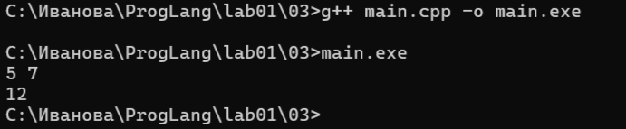 

### Задание 4

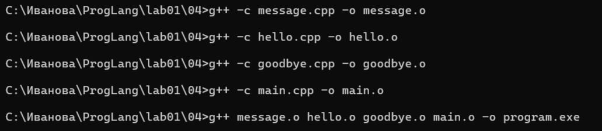
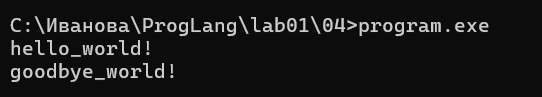
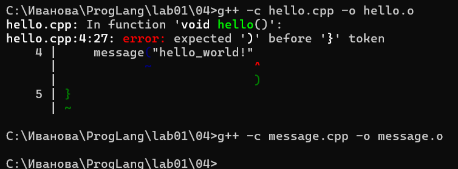
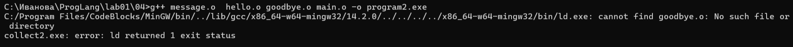

### Задание 7

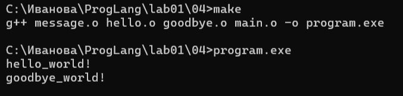
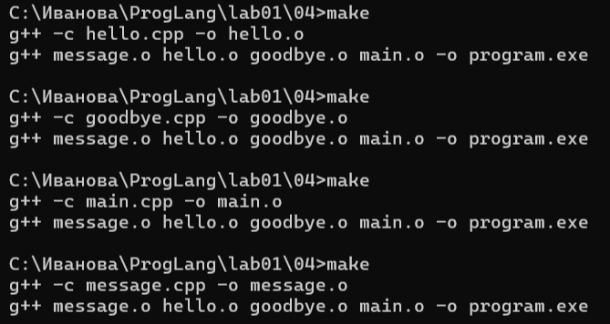
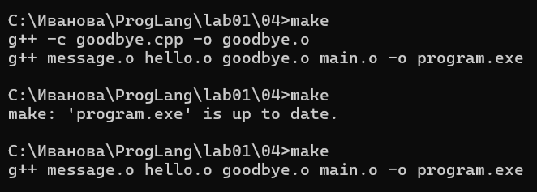

### Задание 8

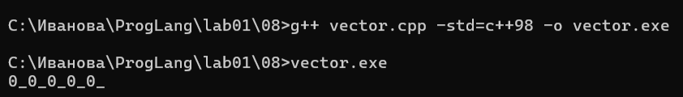
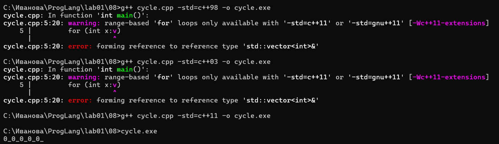
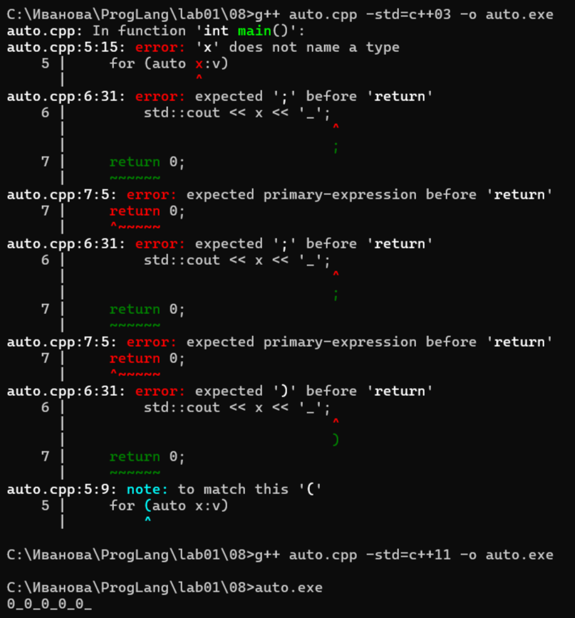
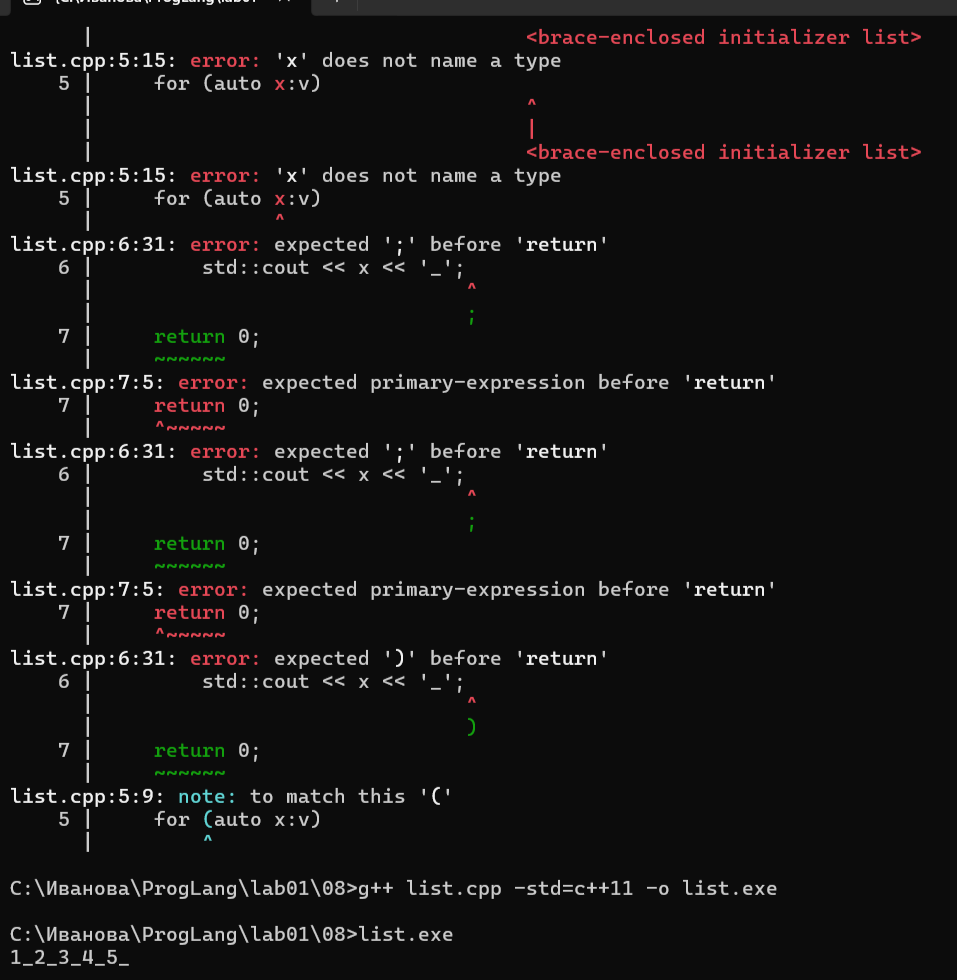
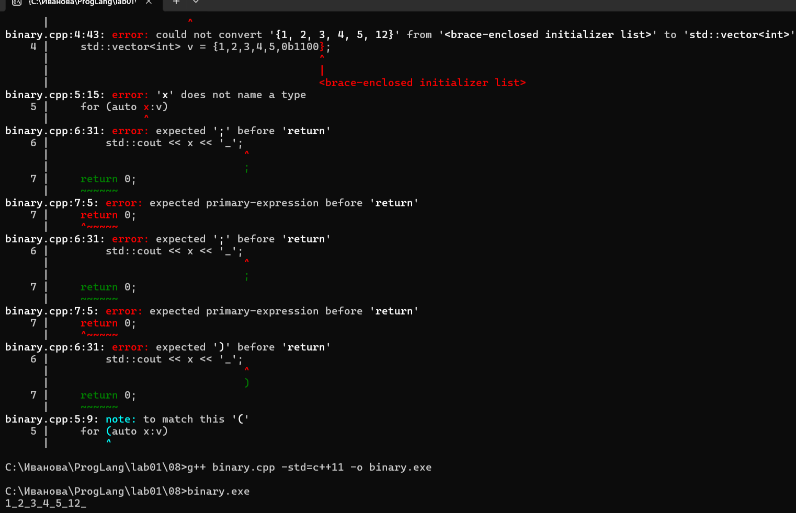
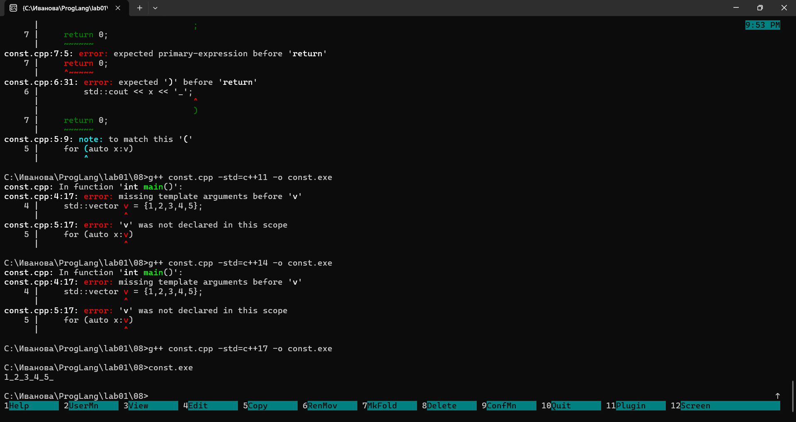

### Задание 9

#### В mainO0:
```.L3:
    cmp $122, -8(%rbp)      сравнивает i c 122
    jg .L2                  если i > 122 выйти из цикла
    movl -12(%rbp), %eax    eax = x
    addl %eax, -4(%rbp)     s += x
    addl $1, -8(%rbp)       i++
    jmp .L3                 вернуться
.L2:
    cmp $122, -8(%rbp)
    jle .L3
```
При опримизации O0 цикл исходной программы сохраняется практически без изменений.В ассемблере есть счётчик, прибаление x к s, увеличение счётчика и переход к началу.

#### В mainO1:
```
movl 44(%rsp), %edx         edx = x
movl $123, %eax             eax = 123
.p2align 3
.L2:
    subl $1, %eax           eax = eax - 1
    jne .L2                 вернуться
imull $123, %edx, %edx      s = x * 123
```
При оптимизаци O1 компилятор обнаруживает, что х прибавляется к сумме 123 раза, поэтому заменяет эту операцию на умножение.И здесь еще остается цикл со счётчиком.

#### В mainO2:
```
call _ZNSirsERi
imull $123, 44(%rsp), %edx          x * 123
movq .refptr._ZSt4cout(%rip), %rcx
call _ZNSoLsEi
```
При оптимизации O2 полностью убирается цикл, остается только прямое умножение.

Таким образом,увеличение уровня оптимизации приводит к более эфективному машинному коду. 


